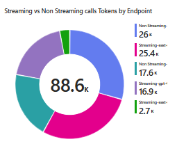
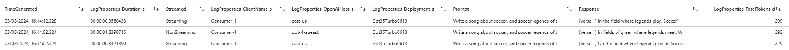

# AI Central


[](https://opensource.org/licenses/mit)
[](https://www.nuget.org/packages/aicentral/)


AI Central gives you control over your AI services.

- Minimal overhead - written on Asp.Net Core, on dotnet 8. One of the fastest web-servers in the business.
- Lightweight out-the-box token metrics surfaced through Open Telemetry
  - **Does not buffer and block streaming** 
  - Use for PTU Chargeback scenarios
  - Gain quick insights into who's using what, how much, and how often
  - Standard Open Telemetry format to surface Dashboards in you monitoring solution of choice
- Prompt and usage logging to Azure Monitor
  - **Works for streaming endpoints as-well as non streaming**
- Intelligent Routing
  - Random endpoint selector
  - Prioritised endpoint selector with fallback
  - Lowest Latency endpoint selector
- Can proxy asynchronous requests such as Azure Open AI Image Generation across fleets of servers
- Custom consumer OAuth2 authorisation
- Can mint JWT time-bound and consumer-bound JWT tokens to make it easy to run events like Hackathons without blowing your budgets! 
- Circuit breakers, and backoff-retry over downstream AI services
- Local token rate limiting
  - By consumer / by endpoint
  - By number of tokens (including streaming by estimated token count)
- Local request rate limiting
  - By consumer / by endpoint
- Bulkhead support for buffering requests to backend

> Extensibility model makes it easy to build your own plugins

## Configuration

See [Configuration](./docs/configuration.md) for more details.

> The Azure Open AI SDK retries by default. As AI Central does this for you you can turn it off in the client by passing ```new Azure.AI.OpenAI.OpenAIClientOptions()  {
RetryPolicy = new RetryPolicy(0) }``` when you create an OpenAIClient

## Minimal

This sample produces a AI-Central proxy that
 - Listens on a hostname of your choosing
 - Proxies directly through to a back-end Open AI server
 - Can be accessed using standard SDKs

### Installation

#### Docker

```bash
# Run container in Docker, referencing a local configuration file
docker run -p 8080:8080 -v .\appsettings.Development.json:/app/appsettings.Development.json -e ASPNETCORE_ENVIRONMENT=Development graemefoster/aicentral:latest
```

#### Asp.Net CORE 

```bash
#Create new project and bootstrap the AICentral nuget package
dotnet new web -o MyAICentral
cd MyAICentral
dotnet add package AICentral
#dotnet add package AICentral.Logging.AzureMonitor
```
#### Program.cs
```csharp
//Minimal API to configure AI Central
var builder = WebApplication.CreateBuilder(args);

builder.Services.AddAICentral(builder.Configuration);

app.UseAICentral(
    builder.Configuration,
    //if using logging extension
    additionalComponentAssemblies: [ typeof(AzureMonitorLoggerFactory).Assembly ]
);

var app = builder.Build();

app.Run();


```

### appsettings.&lt;environment&gt;.json
```json
{
  "AICentral": {
    "Endpoints": [
      {
        "Type": "AzureOpenAIEndpoint",
        "Name": "openai-1",
        "Properties": {
          "LanguageEndpoint": "https://<my-ai>.openai.azure.com",
          "AuthenticationType": "Entra"
        }
      }
    ],
    "AuthProviders": [
      {
        "Type": "Entra",
        "Name": "aad-role-auth",
        "Properties": {
          "Entra": {
            "ClientId": "<my-client-id>",
            "TenantId": "<my-tenant-id>",
            "Instance": "https://login.microsoftonline.com/"
          },
          "Requirements" : {
            "Roles": ["required-roles"]
          }
        }
      }
    ],
    "EndpointSelectors": [
      {
        "Type": "SingleEndpoint",
        "Name": "default",
        "Properties": {
          "Endpoint": "openai-1"
        }
      }
    ],
    "Pipelines": [
      {
        "Name": "AzureOpenAIPipeline",
        "Host": "mypipeline.mydomain.com",
        "AuthProvider": "aad-role-auth",
        "EndpointSelector": "default"
      }
    ]
  }
}

```

## Enriched telemetry and logging

Out of the box AI Central emits Open Telemetry metrics with the following dimensions:
- Consumer
- Endpoint
- Pipeline
- Prompt Tokens
- Response Tokens **including streaming**

Allowing insightful dashboards to be built using your monitoring tool of choice.



AI Central also allows fine-grained logging. We ship an extension that logs to Azure Monitor, but it's easy to build your own.



See [advanced-otel](./docs/advanced-otel.md) for dashboard inspiration!

## Full example

This pipeline will:

- Present an Azure Open AI, and an Open AI downstream as a single upstream endpoint
  - maps the incoming deployment Name "GPT35Turbo0613" to the downstream Azure Open AI deployment "MyGptModel"
  - maps incoming Azure Open AI deployments to Open AI models
- Present it as an Azure Open AI style endpoint
- Protect the front-end by requiring an AAD token issued for your own AAD application
- Put a local Asp.Net core rate-limiting policy over the endpoint
- Add logging to Azure monitor 
  - Logs quota, client caller information, and in this case the Prompt but not the response. 

```json
{
  "AICentral": {
    "Endpoints": [
      {
        "Type": "AzureOpenAIEndpoint",
        "Name": "openai-priority",
        "Properties": {
          "LanguageEndpoint": "https://<my-ai>.openai.azure.com",
          "AuthenticationType": "Entra|EntraPassThrough|ApiKey",
          "ModelMappings": {
            "Gpt35Turbo0613": "MyGptModel"
          }
        }
      },
      {
        "Type": "OpenAIEndpoint",
        "Name": "openai-fallback",
        "Properties": {
          "LanguageEndpoint": "https://api.openai.com",
          "ModelMappings": {
            "Gpt35Turbo0613": "gpt-3.5-turbo",
            "Ada002Embedding": "text-embedding-ada-002"
          },
          "ApiKey": "<my-api-key>",
          "Organization": "<optional-organisation>"
        }
      }
    ],
    "AuthProviders": [
      {
        "Type": "Entra",
        "Name": "simple-aad",
        "Properties": {
          "Entra": {
            "ClientId": "<my-client-id>",
            "TenantId": "<my-tenant-id>",
            "Instance": "https://login.microsoftonline.com/",
            "Audience": "<custom-audience>"
          },
          "Requirements" : {
            "Roles": ["required-roles"]
          }
        }
      }
    ],
    "EndpointSelectors": [
      {
        "Type": "Prioritised",
        "Name": "my-endpoint-selector",
        "Properties": {
          "PriorityEndpoints": ["openai-1"],
          "FallbackEndpoints": ["openai-fallback"]
        }
      }
    ],
    "GenericSteps": [
      {
        "Type": "AspNetCoreFixedWindowRateLimiting",
        "Name": "window-rate-limiter",
        "Properties": {
          "LimitType": "PerConsumer|PerAICentralEndpoint",
          "MetricType": "Requests",
          "Options": {
            "Window": "00:00:10",
            "PermitLimit": 100
          }
        }
      },
      {
        "Type": "AzureMonitorLogger",
        "Name": "azure-monitor-logger",
        "Properties": {
          "WorkspaceId": "<workspace-id>",
          "Key": "<key>",
          "LogPrompt": true,
          "LogResponse": false,
          "LogClient": true
        }
      }
    ],
    "Pipelines": [
      {
        "Name": "MyPipeline",
        "Host": "prioritypipeline.mydomain.com",
        "EndpointSelector": "my-endpoint-selector",
        "AuthProvider": "simple-aad",
        "Steps": [
          "window-rate-limiter",
          "azure-monitor-logger"
        ],
        "OpenTelemetryConfig": {
          "AddClientNameTag": true,
          "Transmit": true
        }
      }
    ]
  }
}

```
